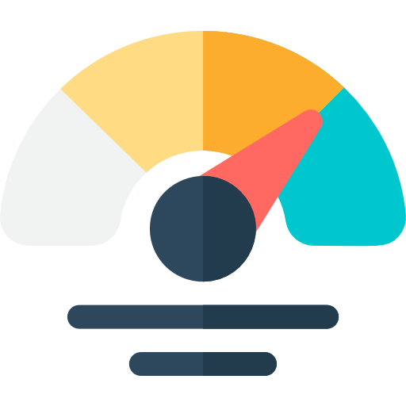

<div align="center" id="top"> 
  

  &#xa0;

  <a href="https://dashboard.netlify.com">Click aqui para ver o Dashboard</a>
</div>

<h1 align="center">Dashboard</h1>

<p align="center">
  
  
</p>
<p align="center">
  
  
</p>

<!-- Status -->

<!-- <h4 align="center"> 
	🚧  Dashboard 🚀 Em construção...  🚧
</h4> 

<hr> -->

<p align="center">
  <a href="#dart-sobre">Sobre</a> &#xa0; | &#xa0; 
  <a href="#sparkles-funcionalidades">Funcionalidades</a> &#xa0; | &#xa0;
  <a href="#rocket-tecnologias">Tecnologias</a> &#xa0; | &#xa0;
  <a href="#x-A-fazer">A fazer</a> &#xa0; | &#xa0;
  <a href="#white_check_mark-Feito">Feito</a> &#xa0;
</p>
<p align="center">
  <a href="#white_check_mark-pré-requisitos">Pré requisitos</a> &#xa0; | &#xa0;
  <a href="#checkered_flag-começando">Começando</a> &#xa0; | &#xa0;
  <a href="#memo-licença">Licença</a> &#xa0; | &#xa0;
  <a href="https://github.com/MaiconAvila" target="_blank">Autor</a>
</p>

<br>

## :dart: Sobre ##

Dashboard para observar os dados e tomar decisões importantes na gestão da frota e pedidos.

## :sparkles: Funcionalidades ##

:heavy_check_mark: Tabela com os dados\
:heavy_check_mark: Gráficos\
:heavy_check_mark: Paginação com 20 linhas por página\
:heavy_check_mark: Responsivo\
:heavy_check_mark: Paginação com página atual e total de páginas

## :rocket: Tecnologias ##

As seguintes ferramentas foram usadas na construção do projeto:

- [React](https://pt-br.reactjs.org/)
- [Node.js](https://nodejs.org/en/)
- [Tailwind](https://tailwindcss.com/)
- [Chart.js](https://www.chartjs.org/docs/latest/)
- [React Router](https://reactrouter.com/en/v6.3.0/getting-started/overview)

## :x: A fazer ##
- [ ]  Testes
  - [ ]  Integração
  - [ ]  Renderização da tabela
  - [ ]  Renderização dos gráficos
  - [ ]  Funcionamento dos botões de paginação
- [ ]  Storybook (documentação do front end)
- [ ]  Clean code
- [ ]  Solid
- [ ]  Token
- [ ]  Tela de login e cadastro
- [ ]  Telas de erro
- [ ]  Tela do item da tabela com os dados
- [ ]  Tela de Adição de demanda
- [ ]  Tela só para a tabela
- [ ]  Tela só para os gráficos

## :white_check_mark: Feito ##
- [x]  Absolute path
- [x]  Componente de tabela
- [x]  Gráficos
- [x]  Paginação com 20 linhas por página
- [x]  Responsivo
- [x]  Paginação adicionar: página atual e total de páginas

## :white_check_mark: Pré requisitos ##

Antes de começar :checkered_flag:, você precisa ter o [Git](https://git-scm.com) e o [Node](https://nodejs.org/en/) instalados em sua maquina.

## :checkered_flag: Começando ##

```bash
# Clone este repositório
$ git clone https://github.com/MaiconAvila/dashboard.git

# Entre na pasta
$ cd dashboard

# Instale as dependências
$ yarn

# Para iniciar o projeto
$ yarn start

# O app vai inicializar em <http://localhost:3000>
```

## :memo: Licença ##

Este projeto está sob licença MIT. Veja o arquivo [LICENSE](LICENSE.md) para mais detalhes.


Feito com :heart: por <a href="https://github.com/MaiconAvila" target="_blank">Maicon Avila</a>

&#xa0;

<a href="#top">Voltar para o topo</a>
